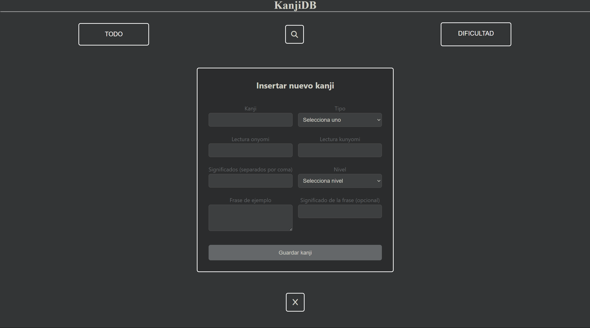

# Base de datos y API de kanjis



---

### Instrucciones para ejecutar
1. Crear el entorno virtual y activarlo mediante el uso de los siguietnes comandos:

```cmd
python -m venv env
```

> Puedes cambiar "env" por el nombre que quieras ponerle, esto crea el entorno virtual

```cmd
.\env\Scripts\activate
```

> Este comando nos sirve para activar el entorno virtual

<br>

2. Instalar los paquetes necesarios:

```cmd
pip install -r requirements.txt
```

<br>

3. Ejecutar la aplicación flask:

```cmd
flask --app main.py --debug run
```

<br>

### Rutas

#### 1. / (GET) 

> Hace un GET al index, se carga nada mas entrar a la aplicación.

#### 2. /all (GET)

> Presenta todo el contenido de la base de datos.

#### 3. /kanji?kanji= (GET)

> Muestra toda la información de un solo kanji.

#### 4. /nivel?nivel= (GET)

> Muestra todos los kannjis que caigan bajo el nivel seleccionado.

#### 5. /eliminar?kanji= (DELETE)

> Elimina el Kanji especificado.

#### 6. /add (POST - FORM)

> Permite añadir un kanji con su tipo, lectura onyomi, lectura kunyomi, significado, frases, traduccion y nivel.

<br><br>

:warning: Para reestablecer la base de datos utilizar el siguiente comando:

```cmd
sqlite3.exe kanji.db < kanji.sql
```